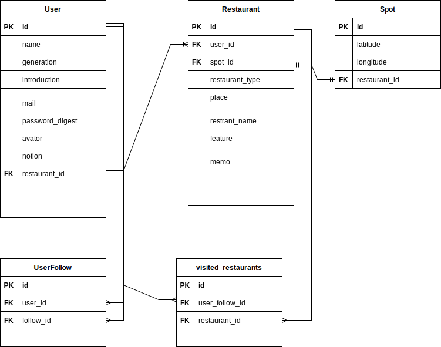

# portfolio
### サービス概要
  飲食店選びで迷ってしまう人が  
  楽に楽しく店選びができるになる  
  飲食店のメモリストです  

### メインのターゲットユーザー
  ・優柔不断な人  
  ・飲食店選びが億劫な人  

### ユーザーが抱える課題
  ・気になる飲食店はあるが、忘れてしまう  
  ・ごはんを食べに行く際に店選びに迷う、提案することが苦手  
  ・どこでもいいが探すことが面倒  

### 解決方法
  ・行きたい店を見つけた時に簡単にメモできる  
  ・店を選ぶ時にリストからランダムで選べるようにすることで、店選びに困らなくなる。  
 ・ 他人のメモリストを見れるので、行く相手との関係を踏まえて店選びの参考にすることができる。  

　■実装予定の機能  
  ログインユーザー  
    [ 自分の飲食店メモリストの管理 ]  
      ・気になる飲食店の保存  
        ・googleマップページで飲食店メモを保存できる  
        ・メモ新規作成ページで飲食店メモを作成、保存できる  
        ・他のユーザー詳細ページで飲食店メモを保存できる  
      ・自分の飲食店メモ一覧、詳細、編集、削除  
      ・自分の飲食店メモ一覧ページで条件の絞り込みができる  
      ・自分の飲食店メモ一覧ページで行く店をランダムで決定できる  
      ・フォローした他ユーザーの飲食店メモ一覧ページで行ったよボタンが押せる  
      ・飲食店一覧マップページで保存した飲食店が地図上で見れる  
      ・自分の飲食店の情報がランダムでメールで通知される  

    [ 他人の飲食店メモリストが見れる ]  
      ・他のユーザーの一覧  
      ・他のユーザーの詳細ページで飲食店の一覧が見れる  
      ・他のユーザーの飲食店メモ一覧ページで条件の絞りこみができる  
      ・他のユーザーの飲食店メモ一覧ページで行く店をランダムで決定できる  
      ・他のユーザーの一覧ページからフォローできる  

  未ログインユーザー  
    [ 他人の飲食店メモリストが見れる ]  
      ・他のユーザーの一覧  
      ・他のユーザーの詳細ページで飲食店の一覧が見れる  
      ・他のユーザーの飲食店メモ一覧ページで条件の絞りこみができる  
      ・他のユーザーの飲食店メモ一覧ページで行く店をランダムで決定できる  

### なぜこのサービスを作りたいのか？
  友達とごはん行こうとなっても店選び、場所選び、どこでもいいけど探すのが面倒。  
  気を遣って、自分が探さなきゃと思ってもどこでもいいのに時間がかかってしまう。  
  そんなときにランダムに決めれたり、他人の行きたいところに決めれたら楽しいなと思いました。  

  ○ 気になる飲食店を簡単にメモしたい
    飲食店を記録するアプリは多いですが、簡単にメモ感覚で記録できるものがなかったのでシンプルに整理できるものが欲しいと思いました。  

  ○ ガチャガチャ感覚で決めたい
    「尾行めし」(赤の他人のあとを付いて行き、同じ店に入ること)のように、
    人の行きたい店に先に行く感覚も楽しそうと思いました。  
    また、同世代や違う世界の人はどんなところに行ってるのか気になるし、参考にもなると思いました。  

### 画面遷移図
Figma：https://www.figma.com/file/YKapNsOli55UySFSUrTUS5/%E3%83%9D%E3%83%BC%E3%83%88%E3%83%95%E3%82%A9%E3%83%AA%E3%82%AA?node-id=0%3A1&t=ONrqOjYSxUJFlf6B-1

### READMEに記載した機能
- [x] ユーザー登録機能
- [x] ログイン機能
- [x] パスワード変更機能
- [x] 記事投稿機能
- [x] 記事閲覧機能（未ログインでも閲覧可）
- [x] 記事編集機能
- [x] 記事削除機能
- [x] いいね機能(行ったよ機能)
- [x] いいね解除機能(行ったよ機能)
- [x] フォロー機能
- [x] 検索機能
- [x] ランダム機能
- [x] マップ上に位置情報を表示
- [x] メール通知機能(定期的)

### 未ログインでも閲覧or利用できるページ
以下の項目はちゃんと未ログインでも閲覧or利用できる画面遷移になっているか？
- [x] 記事投稿機能（画像投稿含む）

### メールアドレス・パスワード変更確認項目
直に変更できるものではなく、一旦メールなどを介して専用のページで変更する画面遷移になっているか？
- [x] パスワード

### ER図

エンティティ  
・ユーザー  
・飲食店  
・スポット(マップでの位置)  
・フォローユーザー  
・行ったよボタン  

ユーザーは複数のフォロワーを持てる  
ユーザーは複数の飲食店を登録できる  
ユーザーは複数の飲食店に行ったよボタンを押せる  

飲食店は1人のユーザーに紐づく  
飲食店は複数のフォローユーザーに紐づく  
飲食店は複数のスポットに紐づく  
飲食店は複数の行ったよボタンを持つ  

フォローユーザーは1人のユーザーに紐ついている  
フォロ-ユーザーは複数の飲食店を持てる  

行ったよボタンは複数の飲食店に紐づく  
行ったよボタンは複数のユーザーに紐づく  

スポットは一つの飲食店に紐づく  

| ユーザーテーブル[User]           |                 |          |                         |                       |
|--------------------------|-----------------|----------|-------------------------|-----------------------|
|                          | id              | bigint   |                         |                       |
| ニックネーム                   | name            | string   | not null                |                       |
| メール                      | e-mail          | string   | unique: true, not null  |                       |
| 年代                       | generation      | string   |                         |                       |
| 職業or一言                   | introduction    | string   |                         |                       |
| パスワード                    | password        | string   | not null                |                       |
| パスワード確認                  | password_digest | string   | not null                |                       |
| アバター                     | avator          | string   |                         |                       |
| メール通知                    | notion          | boolean  | default: true, not null |                       |
| 飲食店                      | restaurant_id   | string   | foreign_key             | has_many :restaurant  |
| フォローユーザー                 | follow_user_id  | string   | foreign_key             | has_many :follow_user |
| 行ったよボタン                  | gone_id         | string   | foreign_key             | has_many :gone        |
|                          |                 |          |                         |                       |
|                          |                 |          |                         |                       |
| 飲食店テーブル[Restaurant]      |                 |          |                         |                       |
|                          | id              | bigint   |                         |                       |
| カテゴリアイコン                 | restaurant_type | string   |                         |                       |
| 店舗名                      | restaurant      | string   | not null                |                       |
| 場所                       | place           | string   | not null                |                       |
| 特徴                       | feature         | string   |                         |                       |
| メモ                       | memo            | string   | maximum: 300            |                       |
| ユーザー                     | user_id         | integer  | references :user        | belong_to :user       |
| スポット                     | spot_id         | integer  | foreign key             | has_one :spot         |
| 行ったよボタン                  | gone_id         | integer  | foreign key             | has_many :gone        |
| フォローユーザー                 | follow_user     | integer  | foreign key             | has_many :follow_user |
|                          |                 |          |                         |                       |
| スポットテーブル[Spot]           |                 |          |                         |                       |
|                          | id              | bigint   |                         |                       |
| 緯度                       | latitude        | float    | not null                |                       |
| 経度                       | longitude       | float    | not null                |                       |
| 飲食店                      | restaurant_id   | integer  | references :restaurant  | belong_to :restaurant |
|                          |                 |          |                         |                       |
|                          |                 |          |                         |                       |
| フォローユーザーテーブル[FollowUser] |                 |          |                         |                       |
|                          | id              | bigint   |                         |                       |
| ユーザー                     | user_id         | string   | references :user        | belong_to :user       |
| 飲食店                      | restaurant_id   | string   | references :restaurant  | belong_to :restaurant |
|                          |                 |          |                         |                       |
|                          |                 |          |                         |                       |
| 行ったよボタンテーブル[Gone]        |                 |          |                         |                       |
|                          | id              | bigint   |                         |                       |
| フォローユーザー                 |                 | string   | references :user        | has_many :user        |
| 飲食店                      | restaurant_id   | string   | references :restaurant  | has_many :restaurant  |

■スケジュール
  企画〜技術調査：11/13〆切 
  README〜ER図作成：11/13 〆切 
  メイン機能実装：11/16 - 12/20
  β版をRUNTEQ内リリース（MVP）：12/21〆切
  本番リリース：12/28
